<!-- HEADERS -->

<p align="center">
  
</p>

<p align="center">
  <b> ~ shved's configuration files ~ </b>
</p>

<div align="center">
    <p></p>
     
     
     
</div>

<div align="center">
     <a href="https://t.me/shvedes">
        
     </a>
        
</div>


<div align="center">

---
# MY BSPWM DOTFILES


## **Screenshots**


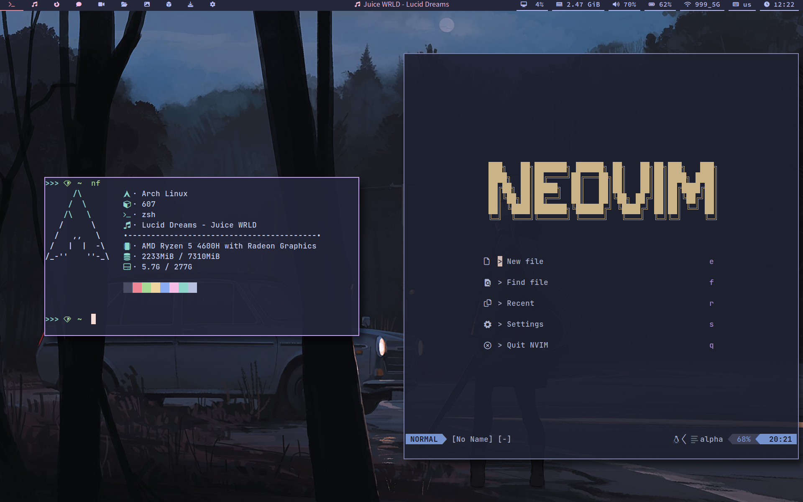 

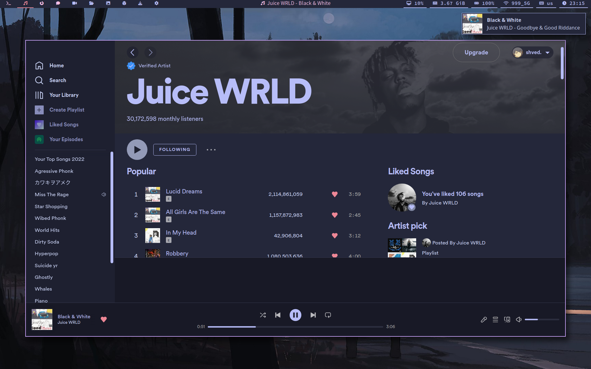

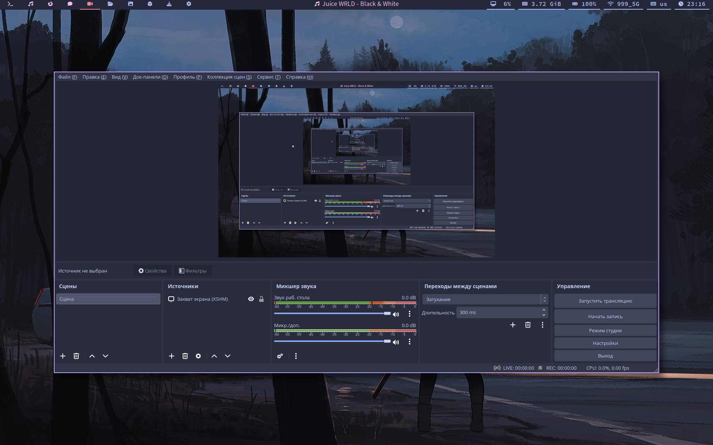

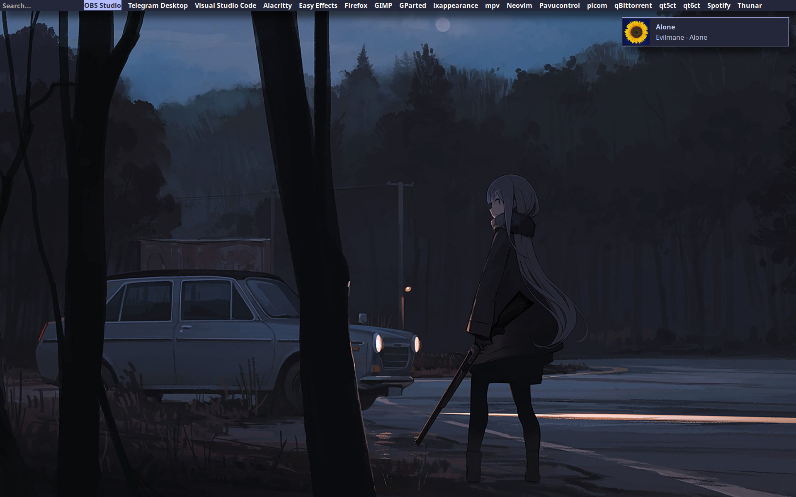

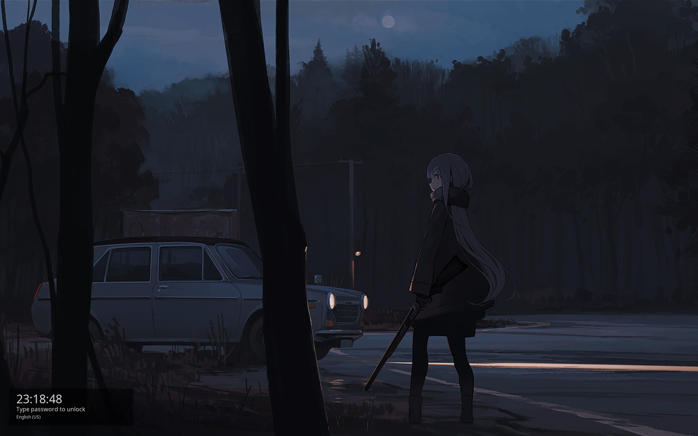

### **Brightness and volume notifications**


</div>

# **Table of Contents**

- **[Environment](#Environment)**
  - **[Used neovim plugins](#used-neovim-plugins)**
  - **[Used Thunar plugins](#used-thunar-plugins)**
- **[Features](#features)**
- **[To do list](#to-do-list)**
- **[Aviables themes](#aviable-themes)**
  - **[Color schemes that I plan to add](#color-schemes-that-i-plan-to-add-list-can-grow)**
  - **[Icons](#icons)**
  - **[Cursors](#cursors)**
  - **[LightDM theme](#lightdm-theme)**
  - **[More screenshots](#more-screenshots-list-can-grow)**
- **[Dependencies](#dependencies)**
- **[BSPWM shortcuts](#bspwm-shortcuts)**
- **[Known issues](#known-issues)**
- **[Contributor note](#contributor-note)**


## **Environment**

- **OS: [Arch Linux](https://archlinux.org/)**
- **Recorder: [OBS](https://obsproject.com/download)**
- **Editor: [Neovim](https://github.com/neovim/neovim)**
- **Browser: [Firefox](https://www.mozilla.org/en-US/firefox/new/)**
- **Terminal: [Alacritty](https://github.com/alacritty/alacritty)**
- **Screenshots: [Maim](https://github.com/naelstrof/maim)**
- **Compositor: [Picom](https://github.com/dccsillag/picom)**
- **App launcher: [Rofi](https://github.com/davatorium/rofi)**
- **Clipboard: [Greenclip](https://github.com/erebe/greenclip)**
- **File manager: [Thunar](https://github.com/xfce-mirror/thunar)**
- **Display manager: [LightDM](https://github.com/canonical/lightdm)**
- **Screen lock: [Betterlockscreen](https://github.com/betterlockscreen/betterlockscreen)**
- **QT theme selector: [qt5ct](https://github.com/desktop-app/qt5ct), [qt6ct](https://github.com/trialuser02/qt6ct)**
- **GTK theme selector: [lxappearance](https://github.com/lxde/lxappearance)**
- **Graphical volume managment: [Pavucontrol](https://github.com/pulseaudio/pavucontrol)**

### **Used neovim plugins**

- **Packer (for managing plugins)**
- **Comment.nvim (usefull shortcuts for comments)**
- **Alpha-nvim (startup dashboard)**
- **Nvim-cmp (autocompletion)**
- **image (preview images in ascii format)**
- **Lualine (same as vim-airline)**
- **Markdown-preview (the name speaks for itself)**
- **Nvim-highlight-colors (the name speaks for itself)**
- **Nvim-tree (file manager)**
- **Staline (bufferline)**
- **Telescope (fzf finder)**

### **Used Thunar plugins**

- **`thunar-archive-plugin` (the name speaks for itself)**
- **`thunar-media-tags-plugin` (bulk rename and manage media files)**

## **Features**

- **Battery critical level / fully charged alert (udev rule)**
- **USB mouse plug in notification (udev rule)**
- **Battery staus notifications (AC source or battery, udev rule)**
- **USB flash drive plug / unplug notifications (udev rule)**
- **Volume / Brightness / Microphone notifications**
- **Compositor animations**
- **Wifi menu (via rofi)**
- **Current track polybar indicator**


## **To do list**

- ~~**Display manager instead of default tty login**~~ Done
- **Theme selector script (not sure)**
- **More themes, more cursors, more icons...**
- ~~**Add more comments in configs**~~ Done


## **Aviable themes**

- **Catppuccin frappe**
- **Catppuccin latte**
- **Catppuccin macchiato**
- **Catppuccin mocha**
- **Gruvbox dark**

### **Color schemes that I plan to add (list can grow)**

- **Gruvbox light**
- **Dracula**
- **Nord**

**NOTE: you can suggest me the color scheme.**

### **Icons**

- **[Stylish](https://github.com/kuroehanako/Stylish-icon-theme)**
- **[Tela](https://github.com/vinceliuice/Tela-icon-theme)**
- **[Nordzy](https://github.com/alvatip/Nordzy-icon)**

### **Cursors**

- **[Material light](https://github.com/varlesh/material-cursors)**
- **[Bibata](https://github.com/ful1e5/Bibata_Cursor)**
- **[Future](https://github.com/yeyushengfan258/Future-cursors)**

### **LightDM theme**

- **[Aether](https://github.com/NoiSek/Aether)**


### **More screenshots (list can grow)**
---
<div align="center"><p><b>Gruvbox</b></p></div>

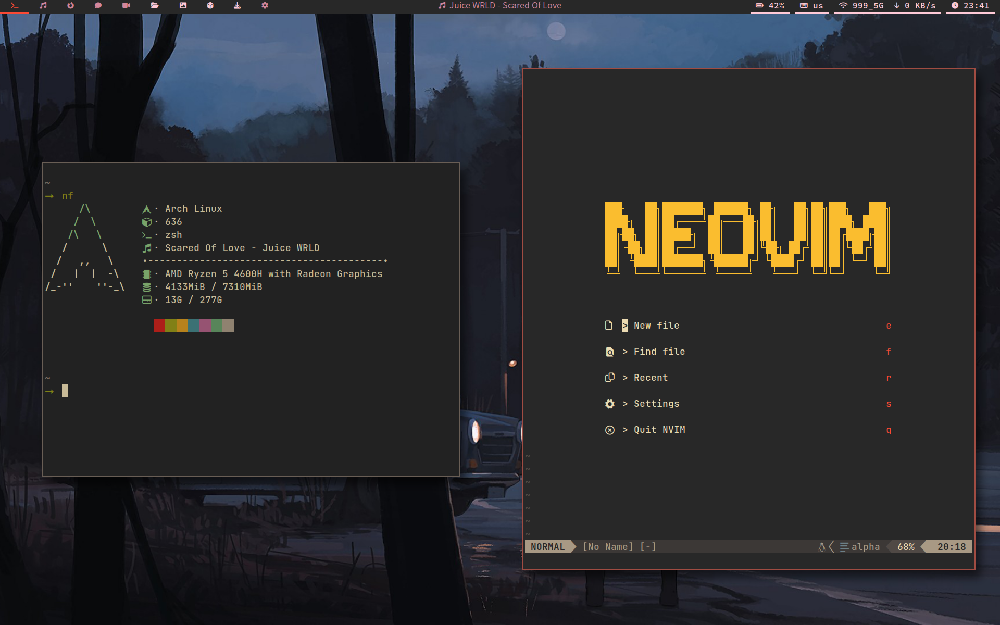

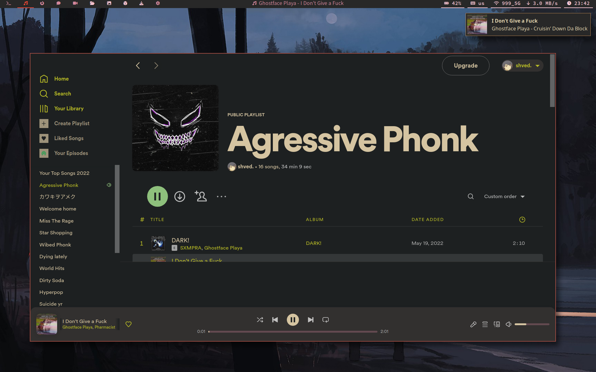

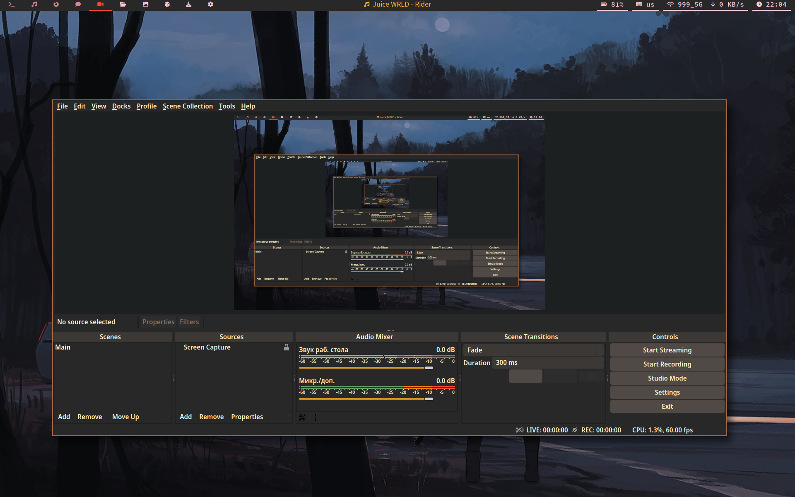

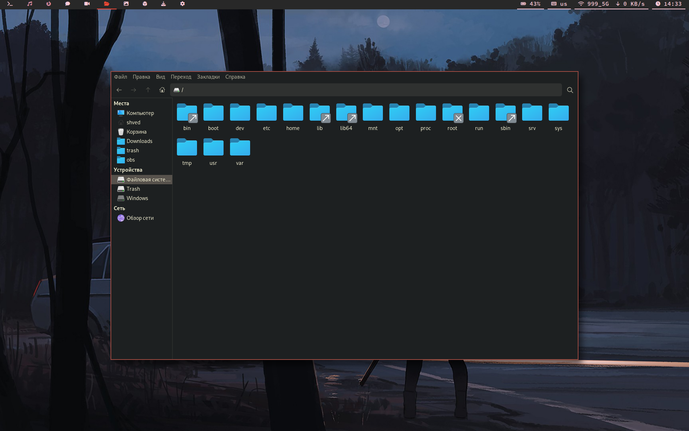

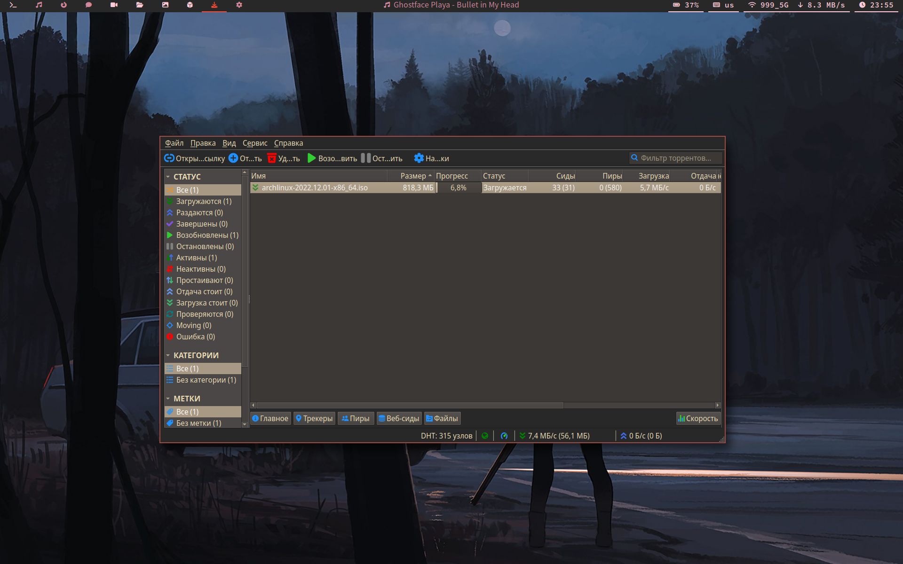

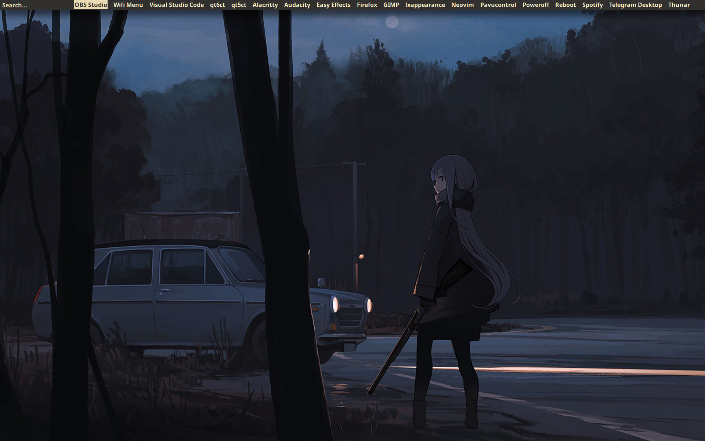

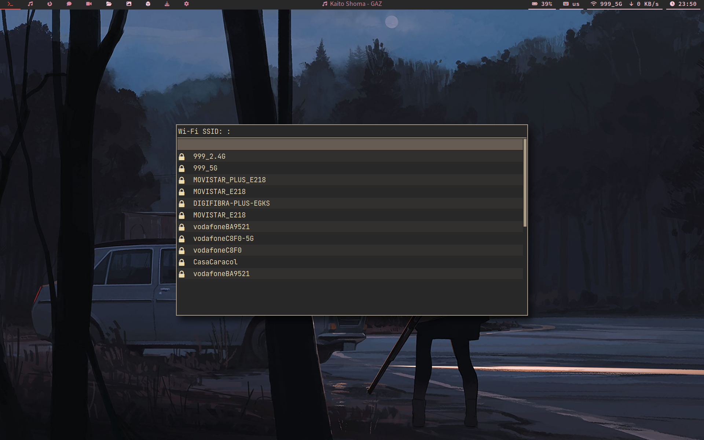

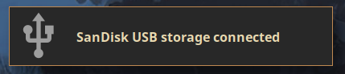
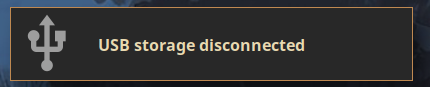
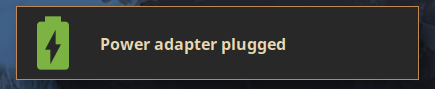
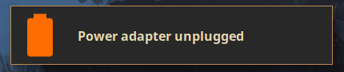
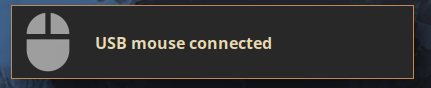


## **Dependencies**

- **`tumbler` (image thumbnails)** 
- **`file-roller` (graphical archive manager)**
- **`xidlehook` (screen saver)**


**All dependencies are aviable in `DEPENDECIES` file. To install them, do the following:**
```
git clone https://github.com/shvedes/dotfiles
cd dotfiles
yay -S $(cat DEPENDENCIES)
```

## **BSPWM shortcuts**


| Parameter        | Shortcut |
| ---------------- | ----------- |
| close window     | super + q |
| fullscreen mode  | super + f | 
| rotate windows   | super + r | 
| focus left       | super + j |
| focues right     | super + k |
| focus top        | super + ; |
| focus bottom     | super + l |
| focus next/prev  | super + n |
| switch layout    | super + m |
| swap left        | super + shift + j |
| swap right       | super + shift + k | 
| swap top         | super + shift + ; |
| swap bottom      | super + shift + l |
| tiled/floating   | super + f | 
| tiled/pseudo_tiled | super + t |
| move window to workspace ***number*** | super + shift + (1-9,0) |
| resize windows   | super + shift + (Arrow keys)
| workspace ***number*** | super + (1-9,0) |
| next workspace   | ctrl + alt + Right |
| prev workspace   | ctrl + alt + Lrft | 
| last workspace   | super + tab |
| restart bspwm & sxhkd | super + shift + r | 
| bspwm quit       | ctrl + alt + q | 
| fullscreen screenshot | super + shift + z | 
| active window screenshot | super + shift + a | 
| area screenshot  | super + shift + s |
| rofi             | super + a |
| clipboard        | super + c | 
| clear clipboard  | super + shift + c |
| thunar           | super + e | 
| spotify (if installed) | ctrl + alt + s |
| firefox          | ctrl + alt + f | 
| terminal         | super + Return |
| change wallpaper | super + shift + w | 
| lock session     | ctrl + shift + l |


## **Known issues**

- **Transparent windows flickering (picom fork issue maybe)**

## **Contributor note**

**Some configs were made with ChatGPT bot :))**

<div align="center"></div>
